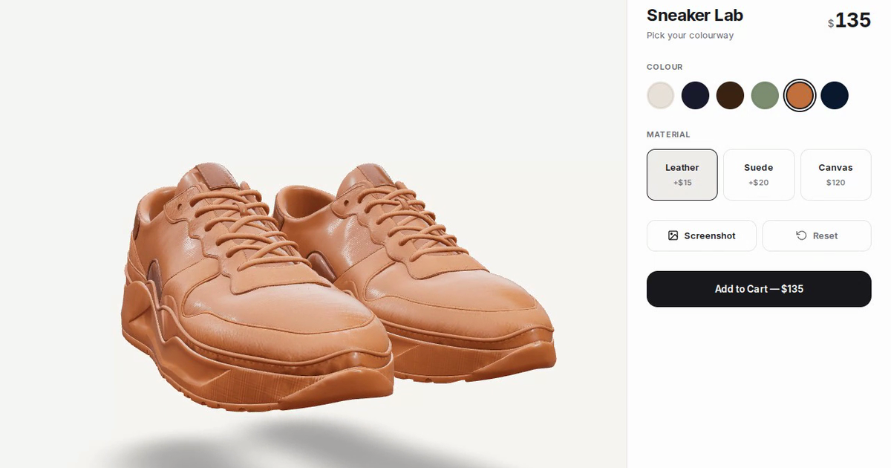

# Sneaker Lab

A real-time 3D sneaker configurator that runs in the browser. Pick a colourway and a material, and the shoes and the price update as you click. Built with Next.js 14, React Three Fiber and a custom colour shader, around a model cut from 16.7 MB to 2.4 MB.

**[Live demo](https://3d-bay-ten.vercel.app)** · **[Write-up: from 16.7 MB to 2.4 MB (dev.to)](https://dev.to/rifatsarkerraju/cutting-a-threejs-product-configurator-from-167-mb-to-24-mb-2bka)** · **[Case study](https://rifatsarkerraju.com/work/3d)**



## Overview

Sneaker Lab is a product page for one pair of sneakers. You can rotate and zoom the 3D model, choose one of six colourways and one of three materials, and watch the price change as you go. On a phone, the controls move into a bottom sheet that you can drag up and down.

It is a front-end project. There is no backend, cart or checkout: **Add to Cart** opens an order summary, and **Confirm Order** closes it.

The engineering is in three places:

- **Model weight.** The source model from Sketchfab was 16.7 MB. The file the app ships is 2.4 MB, 86% smaller, and the app runs at 60 fps on a mid-range Android phone.
- **Recolouring.** A short patch to the built-in three.js material shader recolours the model's baked texture to any colour while keeping its light and shade detail.
- **The interface around the canvas.** A small Zustand store connects a plain React panel to the WebGL scene, with smooth transitions, a mobile bottom sheet and PNG export.

## Features

- Six colourways (Original, Midnight, Espresso, Sage, Terracotta, Navy), applied to the whole pair with a smooth transition
- Three materials: Leather (+$15), Suede (+$20) and Canvas (base price), each with its own roughness and metalness
- Live price ($120 base plus the material surcharge) with an animated counter
- Order summary dialog showing the colour name and hex value, the material and the total
- One-click PNG screenshot of the current view, and a Reset button
- Drag to orbit, scroll or pinch to zoom; auto-rotate pauses while you interact and resumes 3 seconds later
- Loading overlay with a progress bar, a placeholder in the canvas while the model loads, and a fallback if loading fails
- Side panel on desktop; draggable bottom sheet below 768 px
- Open Graph and Twitter card metadata with a 1200 × 630 preview image
- On-page CC BY 4.0 credit for the model

## Performance

| Measure | Value |
| --- | --- |
| Source model (Sketchfab) | 16.7 MB |
| Shipped model, `public/sneaker.glb` | 2.4 MB (2,424,968 bytes), 86% smaller |
| Frame rate on a mid-range Android phone | 60 fps, measured for the write-up |

The [write-up](https://dev.to/rifatsarkerraju/cutting-a-threejs-product-configurator-from-167-mb-to-24-mb-2bka) walks through the process. In short:

1. **Measure first.** Running `gltf-transform inspect` on the source file showed that textures made up most of its weight, so they were the main target.
2. **Compress the geometry with Draco.** The shipped file uses Edgebreaker encoding with per-attribute quantisation: 14 bits for positions, 10 bits for normals (octahedral encoding), and 12 bits for texture coordinates and tangents.
3. **Re-author the textures for the real viewing distance.** The shipped material has three 1024 × 1024 WebP textures: base colour, normal and metallic-roughness.

The result is 113,234 triangles in three meshes, with a single material.

A few runtime choices also matter on phones:

- The canvas pixel ratio is capped at 1.5 (`dpr={[1, 1.5]}`).
- All three meshes share one material, so the patched shader is compiled once.
- Colour, roughness and metalness animate inside React Three Fiber's `useFrame` by changing three.js objects directly, so the 3D transitions never cause React re-renders.
- Draco decoding runs in DRACOLoader's Web Workers, using the WebAssembly decoder served from `public/draco/`.
- three.js is code-split. `page.tsx` loads the scene with `next/dynamic` and `ssr: false`, so the configurator panel is part of the prerendered HTML and the 3D code arrives in a separate chunk.
- `useGLTF.preload` starts the model download as soon as the scene code loads, before the model component renders.

## How it works

### State and data flow

`page.tsx` renders two siblings: `<Scene />`, the WebGL canvas, and `<Configurator />`, the panel. They don't pass props to each other. Both read the same Zustand store:

```ts
// src/lib/store.ts
interface SneakerState {
  color: string;            // hex from COLOR_PALETTE; starts as '#E8E2D9' ("Original")
  material: MaterialId;     // 'leather' | 'suede' | 'canvas'; starts as 'leather'
  setColor: (color: string) => void;
  setMaterial: (material: MaterialId) => void;
  reset: () => void;        // back to Original + Leather
  totalPrice: () => number; // BASE_PRICE + MATERIAL_PRESETS[material].priceDelta
}
```

The price is derived rather than stored, so it can't drift out of sync with the material. Components subscribe through selectors such as `useSneakerStore((s) => s.color)` and re-render only when the value they select changes.

A click travels like this:

```
Configurator.tsx   click a swatch or material card
                   └─ setColor(hex) / setMaterial(id)
store.ts           state updates; subscribed components re-render
                   ├─ Configurator: selection, animated price, cart total
                   └─ Sneaker: copies the new value into a target ref
Sneaker.tsx        useFrame, every frame: moves the shared material's
                   tint colour, roughness and metalness toward the targets
```

Product data lives in `src/lib/modelConfig.ts`: the colour palette, the base price ($120), the model path and the material presets.

| Material | Roughness | Metalness | Price change | Total |
| --- | --- | --- | --- | --- |
| Leather (default) | 0.35 | 0.15 | +$15 | $135 |
| Suede | 0.85 | 0 | +$20 | $140 |
| Canvas | 0.6 | 0 | none | $120 |

The colourway doesn't affect the price.

### The tint shader

The model comes with one baked colour texture, painted in its original colours. Setting `material.color` would multiply the chosen colour into that texture, so the result would depend on how each part happened to be painted. Instead, `Sneaker.tsx` clones the model's material (a `MeshPhysicalMaterial`, because the file uses `KHR_materials_specular`) and patches the clone with `onBeforeCompile`. The patch replaces three.js's base-colour step, `#include <map_fragment>`, with this:

```glsl
#ifdef USE_MAP
  vec4 texelColor = texture2D( map, vMapUv );
  float lum = clamp(dot(texelColor.rgb, vec3(0.299, 0.587, 0.114)), 0.0, 1.0);
  float shade = mix(0.35, 1.0, clamp(lum / 0.6, 0.0, 1.0));
  texelColor.rgb = uTint * shade;
  diffuseColor *= texelColor;
#endif
```

Step by step:

1. Sample the baked colour texture and reduce it to a single luminance value (Rec. 601 weights). The texture's hue is thrown away.
2. Turn that luminance into a shade factor between 0.35 and 1.0. Texels at 60% luminance or brighter get the full colour. Darker texels, which hold the texture's baked shadow detail, darken it, but never below 35%, so the darkest texels don't turn black.
3. Use the chosen colour (`uTint`) multiplied by the shade as the base colour, keeping the texel's alpha.

Everything after this step is the unmodified three.js lighting, so the normal map, the metallic-roughness map and the environment reflections still apply. The material's own `color` is set to white so it doesn't tint the result a second time. `customProgramCacheKey()` returns `'sneaker-tint'`, so three.js caches the patched program separately from an unpatched material with the same settings.

`uTint` is the same `THREE.Color` object that the frame loop animates, so changing colour never needs a uniform update or a shader recompile.

**One material for the whole pair.** The model is three overlapping meshes (`Object_4`, `Object_5`, `Object_6`) that together form the pair. Each one fills gaps in the others, so all three must render, and in the model file they already share one material. `Sneaker.tsx` patches a single material and assigns it to every mesh, so the whole pair always shows the same colourway.

**Materials.** The presets set the material's `roughness` and `metalness`. three.js multiplies those values by the model's metallic-roughness texture (the green channel for roughness, the blue channel for metalness), so the texture's variation is kept and the preset sets the overall level. A material changes how the surface reflects light, not its texture.

### Transitions

A selection only changes target values. Each frame, `useFrame` moves the displayed colour, roughness and metalness toward their targets by `1 - 0.001^delta` of the remaining distance, where `delta` is the frame time in seconds. Because the step depends on elapsed time rather than on the number of frames, a change looks the same at 30, 60 or 120 fps: it is about 97% complete after half a second and 99.9% complete after one second. The same loop adds a slight idle float and sway to the model.

The header price counts toward the new total with `requestAnimationFrame`.

### Loading and the scene

- `useGLTF(MODEL_PATH, '/draco/')`: passing a path string as the second argument makes drei point its DRACOLoader at the decoder in `public/draco/` instead of Google's CDN. drei's `extendLoader` callback can't do this, because drei assigns its own DRACOLoader after the callback runs. The comment in `Sneaker.tsx` has the details.
- While the model loads, `<Suspense>` shows a faint wireframe box in the canvas. `Loader.tsx` shows an HTML overlay with a progress bar driven by drei's `useProgress`, which advances as each asset finishes loading. When everything has loaded, the overlay fades out over 600 ms and unmounts.
- Anything in the canvas that loads over the network gets its own `SceneErrorBoundary`. If the model fails, a plain box is shown in its place. If the environment map fails, the scene simply renders without image-based lighting. Either failure is contained: an uncaught throw from inside the canvas would unmount the whole React tree and blank the page.
- `Sneaker.tsx` measures the model's bounding box, scales the model so its longest side is 2 units, and centres it at the origin. The camera, the zoom limits (2 to 8 units) and the contact shadow are tuned for that size. drei's `<Bounds fit clip observe>` frames the camera on load and again whenever the canvas resizes.
- Lighting comes from an ambient light, a key directional light with 1024 × 1024 shadow maps, and a fill light. drei's `city` environment preset adds image-based lighting, and drei's `ContactShadows` sits under the model.
- **The environment map is self-hosted.** drei's `city` preset fetches `potsdamer_platz_1k.hdr` (1.47 MB) from its asset CDN at runtime. The same file is served from `public/` instead, through `<Environment files="/potsdamer_platz_1k.hdr" />`, so the page makes no request to any origin but its own: one less DNS lookup and TLS handshake, the file cached under the site's own headers, and nothing to break if that CDN is slow or unreachable.
- `OrbitControls` has panning turned off and keeps the camera between 30° and 100° from straight overhead. Auto-rotate stops when you start interacting and restarts 3 seconds after you stop.

### Responsive layout and the bottom sheet

At 768 px and wider, the canvas fills the space next to a fixed 380 px panel. Below 768 px, the canvas takes the top 60% of the screen and the controls move into a fixed bottom sheet, which is 40% of the viewport height at rest. The panel content is written once and rendered into both containers, and CSS decides which one is shown.

The sheet's handle uses Pointer Events with pointer capture, so one code path covers touch, pen and mouse. While you drag, the sheet follows the pointer, staying between 100 px and 90% of the viewport height. When you let go, it snaps to 40% or 85% of the viewport height, whichever is closer, and a CSS transition animates the snap.

### Screenshot export

The canvas is created with `preserveDrawingBuffer: true`, so the Screenshot button can read the last rendered frame with `canvas.toDataURL('image/png')` and download it as `sneaker-lab-<timestamp>.png`.

### Accessibility

- Swatches, material cards and action buttons are native `<button>` elements. You can reach them with Tab, press them with Enter or Space, and see a `:focus-visible` outline.
- The swatches form a labelled radio group. Each one has `role="radio"`, `aria-checked` and the colour name as its label.
- The material cards are toggle buttons with `aria-pressed`.
- The order summary has `role="dialog"` and `aria-modal="true"`, and closes with Escape or a click on the backdrop.
- The bottom sheet's drag handle is a focusable `role="separator"`. It reports its current size through `aria-valuenow`, and Up/Down arrows (or Page Up/Page Down) snap the sheet between 40% and 85%, so it is not a drag-only control.
- Both credit lines in the top-left corner are keyboard reachable, as the last tab stops on the page. The model credit is a paragraph with `pointer-events: none` and only its two links clickable, so the sentence never intercepts a drag meant for the canvas.

## Tech stack

| Area | Choice | Version in `package.json` |
| --- | --- | --- |
| Framework | Next.js (App Router) | `14.2.35` |
| UI | React and React DOM | `^18` |
| Language | TypeScript in `strict` mode | `^5` |
| 3D engine | three.js | `^0.160.0` |
| React renderer for three.js | @react-three/fiber | `^8.15.12` |
| 3D helpers (loaders, controls, environment, shadows) | @react-three/drei | `^9.92.7` |
| State | Zustand | `^4.4.7` |
| Styling | Hand-written CSS with custom-property design tokens in `src/app/globals.css`. Tailwind CSS is installed and its base layer loads, but the components use their own classes. | `tailwindcss ^3.4.1` |
| Font | Inter, through `next/font/google` | n/a |

`package-lock.json` pins the exact installed versions.

## Project structure

```
public/
├── sneaker.glb           # optimised model: Draco geometry, WebP textures
├── draco/                # self-hosted Draco decoder (WebAssembly, plus a JS fallback)
├── potsdamer_platz_1k.hdr # environment map for image-based lighting (Poly Haven, CC0)
└── og.png                # 1200 × 630 social preview image
src/
├── app/
│   ├── layout.tsx        # font, metadata (Open Graph, Twitter), credit lines
│   ├── page.tsx          # Scene (client-only) + Configurator
│   ├── globals.css       # design tokens, layout, bottom sheet, dialog, credits
│   └── favicon.ico
├── components/
│   ├── Scene.tsx         # Canvas, lights, environment, shadows, controls, error boundaries
│   ├── Sneaker.tsx       # model loading, size normalisation, tint shader, frame loop
│   ├── Configurator.tsx  # panel, animated price, screenshot, bottom sheet, order summary
│   ├── Loader.tsx        # loading overlay
│   ├── CreditLink.tsx    # "Built by Raju" link (server component)
│   └── ModelCredit.tsx   # CC BY 4.0 model credit (server component)
└── lib/
    ├── modelConfig.ts    # palette, material presets, prices, model path
    └── store.ts          # Zustand store

LICENSE                   # MIT, with the model and decoder carved out
next.config.mjs           # empty: the defaults are enough
.eslintrc.json            # next/core-web-vitals
tailwind.config.ts        # base layer only; the components use their own CSS
postcss.config.mjs
tsconfig.json             # strict mode, @/* path alias
```

## Checks

`npm run lint` and `npm run build` are the checks this repo has. `next build` type-checks the whole project with `tsc` in `strict` mode as part of the build, so a type error fails the build.

There are no unit tests and no CI workflow. For a single-page demo with no backend and no business logic to speak of, the build and the linter are what is actually worth running; adding a test runner here would be ceremony rather than coverage.

## Getting started

You need Node.js 18.17 or later (the minimum for Next.js 14) and npm.

```bash
git clone https://github.com/Raju0131/3d.git
cd 3d
npm install
npm run dev
```

Then open http://localhost:3000. The optimised model is already in the repo at `public/sneaker.glb`, so there is nothing else to download.

| Command | What it does |
| --- | --- |
| `npm run dev` | Starts the development server |
| `npm run build` | Creates a production build; the page is prerendered as static HTML |
| `npm start` | Serves the production build |
| `npm run lint` | Runs ESLint with `next/core-web-vitals` |

### Using a different model

- The app loads `public/sneaker.glb`. Replace that file, or point `MODEL_PATH` in `src/lib/modelConfig.ts` at another file in `public/`.
- Draco-compressed files work as they are, because the decoder is in `public/draco/`.
- Scale and origin don't matter, because `Sneaker.tsx` resizes the model to 2 units and centres it.
- Every visible mesh gets one material, cloned from the first visible mesh. The recolouring needs that material to have a base-colour texture. Without one, the shader patch is skipped and the model renders plain white.
- To leave a mesh out, add its name to `HIDDEN_MESHES` in `src/lib/modelConfig.ts`. Running `npx gltfjsx your-model.glb` generates a component that shows the mesh names.

## Deployment

The live demo runs on Vercel. The repo has no `vercel.json` and uses no environment variables, so Vercel's default Next.js settings are enough. If you deploy your own copy, change `SITE_URL` in `src/app/layout.tsx`. It sets `metadataBase`, the canonical URL and the Open Graph URL.

## Credits

- **3D model:** ["Sneakers - Game Ready - Textured (Mockup)"](https://sketchfab.com/3d-models/sneakers-game-ready-textured-mockup-d9a4eda1845249a69d3c79814be9efc0) by [kane_sk06](https://sketchfab.com/kanesk06), licensed under [CC BY 4.0](https://creativecommons.org/licenses/by/4.0/). It has been modified: compressed and re-textured for the web as described above, and recoloured at runtime. The same attribution is stored in the file's `asset.extras` and shown on the page.
- **Draco decoder** (`public/draco/`): [Google Draco](https://github.com/google/draco), Apache License 2.0.
- **Environment map** (`public/potsdamer_platz_1k.hdr`): "Potsdamer Platz" from [Poly Haven](https://polyhaven.com/a/potsdamer_platz), released under CC0. It is the file behind drei's `city` preset, copied here so the page serves it itself. CC0 asks for nothing, but it is someone's work and worth naming.

The model is kane_sk06's work. The compression, the colour shader and the front end were built for this project by Md. Raju Ahmed.

## License

The code in this repository is released under the MIT License. The full text is in [`LICENSE`](LICENSE).

The 3D model in `public/sneaker.glb` is not covered by the MIT License. It stays under CC BY 4.0, so any reuse needs the attribution above. The Draco decoder files keep their Apache 2.0 licence, and the environment map is CC0.

## Author

**Md. Raju Ahmed**, full-stack developer in Rajshahi, Bangladesh.

[Portfolio](https://rifatsarkerraju.com) · [Sneaker Lab case study](https://rifatsarkerraju.com/work/3d) · [GitHub](https://github.com/Raju0131)
